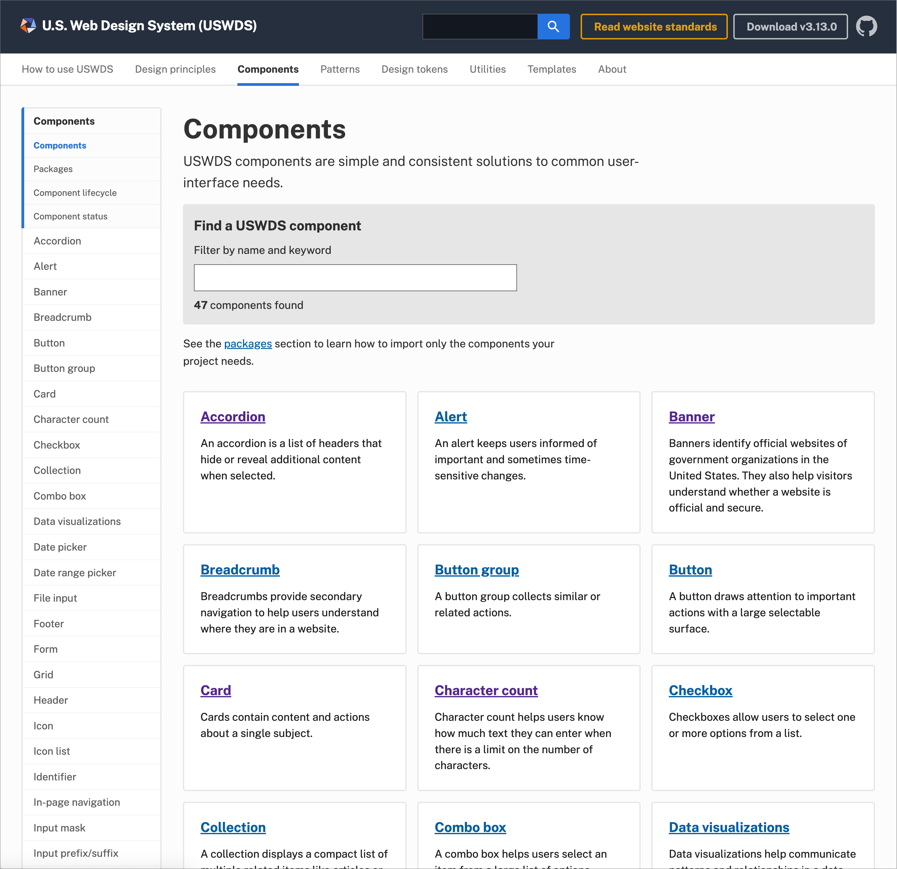
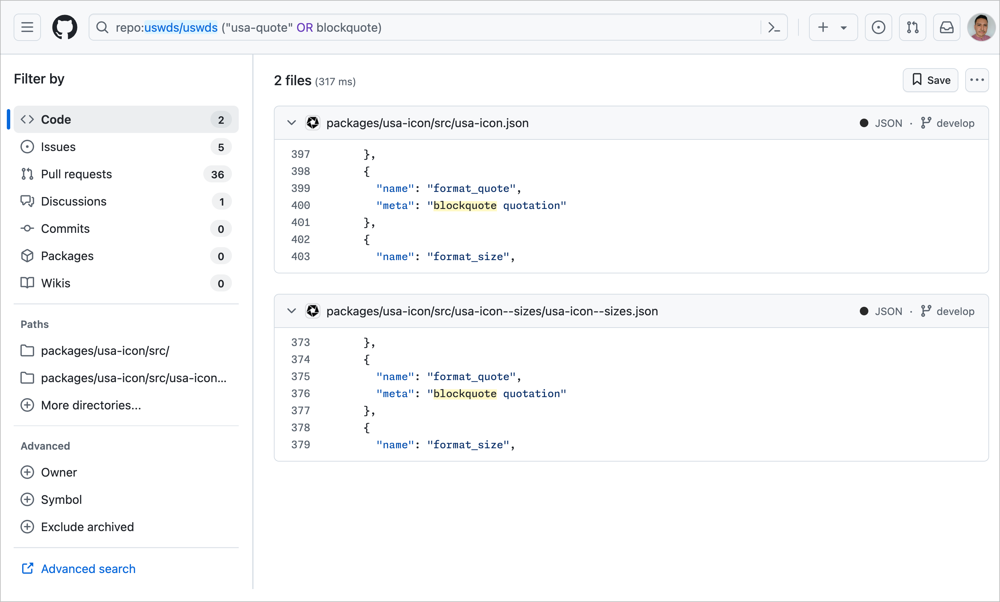

import { Image } from "astro:assets";
import { Steps, Aside } from "@astrojs/starlight/components";

import WireframeQuote from "../../../assets/wireframe-quote.svg";

In this exercise we're going to use USWDS to create a new, custom, component. By the end you should be able to know how USWDS components are made so you can contribute them back in the future to help others.

Below we a quote component that can be seen on many sites nowadays. Although it may appear simple, we're going to apply system level thinking and USWDS design language to extend USWSD and create our own custom component.

<WireframeQuote />

## Searching For Existing Components

Let's make sure we're not duplicating work by checking to see if USWDS offers something already.

{/* prettier-ignore-start */}

<Steps>
1. Our first step is to check the official [USWDS components page](https://designsystem.digital.gov/components/overview/) and see if the component or something related doesn't already exist.

    

    Nothing pops up immediately. Let's continue searching.

1. We know this is a typographic element, so lets check the typography component. On the left-hand sidenav find "Typography" or enter it in the "Find a USWDS component" search box.

1. There's general guidance on the [Typography page](https://designsystem.digital.gov/components/typography/), but no actual quote mentioned. The left-hand sidenav also has "Prose" listed. It's related to typography, so let's check that.

1. We see an example of prose (long form content), but no quote or blockquote.

1. Just to triple check, we'll visit the [USWDS GitHub repo](https://github.com/uswds/uswds).

   USWDS components are prefixed with `usa`, so lets search `usa-quote` or `blockquote`:

   ```sh
   repo:uswds/uswds ("usa-quote" OR blockquote)
   ```

   

   No components appear, but we do get an icon, which might be helpful later.

</Steps>

{/* prettier-ignore-end */}

## Creating the Component

We've made sure this component doesn't exist already and will need to create a new one. Looking at our component again, let's think about how we'll build this.

<WireframeQuote />

It's important to think about:

1. Component content and fallbacks
   1. What if we don't have a profile image?
   1. What if we don't have an author at all?
1. Customizations
   1. How much configuration or theme settings do we need to create? Too few and users might have to add their own overrides. Too many and it'll be too much work or confusing to configure.

With those considerations in mind, we'll start small and do our best to provide a "good" default that has:

1. Top section for the quote which has:
   1. A quote mark, either text or an icon.
   1. The quote itself
1. A bottom section for the meta information which includes:
   1. A title.
   1. An author section with: Profile picture, Full name, and Title.

No matter the tech stack of your design system, we'll need to make sure we're using accessible, semantic, markup. We know there's a [Blockquote element | MDN](https://developer.mozilla.org/en-US/docs/Web/HTML/Reference/Elements/blockquote), which we'll use as our foundation.

{/* prettier-ignore-start */}

<Steps>
1. In the demo repo, make sure the component library is running [`npm run lib`] and go to http://localhost:6060/. Open the quote component that's listed in the sidebar.

1. In your browser, go to the [Default Quote](http://localhost:6060/?path=/story/components-quote--default&globals=viewport.value:mobile1) in Storybook. This is where we'll see the preview of the component as we develop.

1. In your code editor, open `quote.html.twig`. Right now its pretty barebones and is based off of the MDN example. We'll need to add our classes.

    ```html
    <!-- quote.html.twig -->
    <div>
      <blockquote>
        <p>
          Transforming Government Services with Digital and Human-Centered Solutions
        </p>
      </blockquote>
      <p>
        
        <span>Jane Smith</span>
        <span>Creative Director</span>
      </p>
    </div>
    ```

1. We'll be using **B**lock **E**lement **M**odifier classes, just like USWDS. This is Drupal Govcon, so we'll use `dg` as our prefix.

    Let's add our top-level component class, `dg-quote`.

    <Aside type="note">
      We won't be using the `usa` prefix because we don't want it to be confused for an _official_ component.
    </Aside>

    ```diff
    <!-- quote.html.twig -->
    - <div>
    + <div class="dg-quote">
      <blockquote>
        <p>
          Transforming Government Services with Digital and Human-Centered Solutions
        </p>
      </blockquote>
      <p>
        
        <span>Jane Smith</span>
        <span>Creative Director</span>
      </p>
    </div>
    ```

1. Next, let's add classes for the top sections. We're not adding classes to every element. You should take a minimal approach first to avoid redundant or unnecessary boilerplate.

    Let's split the top and bottom sections. Typically, USWDS components are broken out like semantic layout elements, like `header, body, footer` in the [USA Card](https://designsystem.digital.gov/components/card/) component.

    We'll take a similar approach to this component by adding a body class [`dg-quote__body`] to the blockquote element.

    ```diff
    <!-- quote.html.twig -->
    <div class="dg-quote">
    -  <blockquote>
    +  <blockquote  class="dg-quote__body">
        <p>
          Transforming Government Services with Digital and Human-Centered Solutions
        </p>
      </blockquote>
      <p>
        
        <span>Jane Smith</span>
        <span>Creative Director</span>
      </p>
    </div>
    ```

1. For the bottom section, we have a paragraph, but not everything inside fits semantically. For now, let's convert it to a generic `div` and update once we test in a screen reader, like VoiceOver.

    We'll also add a class. We could either use `footer` or `meta`. In this case, we'll start with a generic approach (footer) and update as we iterate and test.

    Our author and title are also block-level elements in the mockup, so we'll use `divs` for that.

    ```diff
    <!-- quote.html.twig -->
    <div class="dg-quote">
      <blockquote  class="dg-quote__body">
        <p>
          Transforming Government Services with Digital and Human-Centered Solutions
        </p>
      </blockquote>
    -  <p>
    +  <div class="dg-quote__footer">
        
    -    <span>Jane Smith</span>
    +    <div>Jane Smith</div>
    -    <span>Creative Director</span>
    +    <div>Creative Director</div>
    -  </p>
    +  </div>
    </div>
    ```

1. We also know we'll need the image and text to be side-by-side, like in the Gov Banner.

    We could:
      1. Write our own custom CSS.
      1. Use the [grid component](https://designsystem.digital.gov/utilities/layout-grid/) by including `usa-layout-grid`. This is a heavy CSS file though, so avoid unless you'll be doing a lot of custom layouts.
      1. Use media block, like in USA Banner.

      For now, we'll try `media-block` and test before releasing if and how it impacts performance.

      Media block isn't on the official documentation, but we can see it in the live component library, [here](https://federalist-3b6ba08e-0df4-44c9-ac73-6fc193b0e19c.sites.pages.cloud.gov/preview/uswds/uswds/develop/?path=/story/components-media-block--media-block).

    ```diff
    <!-- quote.html.twig -->
    <div class="dg-quote">
      <blockquote  class="dg-quote__body">
        <p>
          Transforming Government Services with Digital and Human-Centered Solutions
        </p>
      </blockquote>
      <p>
      <div class="dg-quote__footer">
        
        <span>Jane Smith</span>
        <div>Jane Smith</div>
        <span>Creative Director</span>
        <div>Creative Director</div>
      </p>
      </div>
    </div>
    ```

    With the main structure set, let's start adding some basic styles and see how far we can get with the current iteration.

1. In your editor, open the SCSS partial `_quote.scss`. We'll definitely need USWDS tokens, so lets add that first.

    ```diff
    // _quote.scss

    + @use "uswds-core" as *;
    ```

    <Aside type="note">
      If you're noticing slow builds, make sure you're **not** forwarding the entire USWDS library in `storybook/packages/index.scss`.

      Remove or comment out `@forward "uswds";`.
    </Aside>

    You can test and make sure it works by using a token in the quote body.

    ```diff
    // _quote.scss

    @use "uswds-core" as *;

    + .dg-quote {
    +   background-color: color("gray-20");
    + }
    ```

    You can leave this for now if you'd like. We'll be replacing it later on.

1. In this step, we'll be adding minimal spacing tokens.

    <Aside type="tip">
      If you're completely new to USWDS tokens you can use default CSS values, like `gray` or `1rem` and the replace those with the correct tokens later on.
    </Aside>

    You can see how other components set radius in the [USWDS Settings page](https://designsystem.digital.gov/documentation/settings/). It's a `unit`, so we can click on the `units` link and see all the available token values. For now, we're just going to use a basic unit of `1`.

    We'll also add some inner padding. We know this is thicker, so we'll double it and use a unit of `2`.

    ```diff
    // _quote.scss
    .dg-quote {
      background-color: color("gray-20");
    +  border-radius: units(1);
    +  padding: units(2);
    }
    ```

1. Next, let's add some typography styles. We know the quote itself is bigger than the other text elements.

    Let's check the typography [settings page](https://designsystem.digital.gov/documentation/settings/#typography-settings-2) to see if there's a global theme setting that can help us create something cohesive and customizable by users.

    We see there's a `lg` size token. The [size token docs](https://designsystem.digital.gov/design-tokens/typesetting/font-size/#using-size-tokens-2) say the function expects a family and size to be specified.

    This is body text and the next level up from `md` is `lg`.

    ```diff
    // _quote.scss

    // …
    + .dg-quote__body {
    +   font-size: size("body", "lg");
    + }
    ```

1. Next, lets add the quote marks. We don't want users to manually type them and we might not want them to be read by screen readers. Let's add as pseudoelements as a start.

    <Aside type="danger">
      Consider cutting for time.
    </Aside>

    <Aside type="note">
      The use of pseudoelement quotes is something we'll definitely have to be aware of during accessibility testing.
    </Aside>

      ```diff
    // _quote.scss

    // …
    .dg-quote__body {
      font-size: size("body", "lg");

    +  &::before,
    +  &::after {
    +    content: "";
    +    display: block;
    + }

    +  &::before {
    +    content: "\201C";
    + }

    +  &::after {
    +    content: "\201D";
    + }


    }
    ```

    <Aside type="tip">
    The CSS codes are from [Toptal](https://www.toptal.com/designers/htmlarrows/punctuation/right-double-quotation-mark/).
    </Aside>

    It's looking better, next lets look at the quote footer.

1. Create add basic styles to the footer. USWDS has a layout grid, but for components that can be heavy when compiling.


</Steps>

{/* prettier-ignore-end */}
