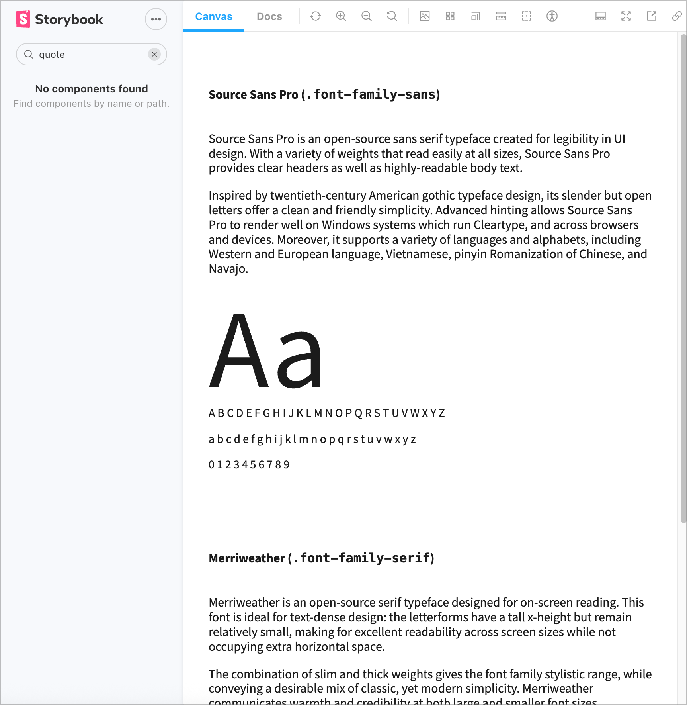

import { Image } from "astro:assets";
import { Steps, Aside } from "@astrojs/starlight/components";

import WireframeQuote from "../../../assets/wireframe-quote.svg";

Now that we've learned what design language is and how it helps us communicate the parts of a design, we're going to use USWDS to create a new, custom, component.

By the end you should know how USWDS components are made so you can branch off of USWDS and create your own.

Below we have a mockup for a quote component. Although it may appear simple, we're going to apply system level thinking and USWDS design language to extend USWDS to create it.

<WireframeQuote />

## Searching For Existing Components

First, let's make sure we're not duplicating effort by checking to see if USWDS already offers something similar.

{/* prettier-ignore-start */}

<Steps>
1. Our first step is to check the official [USWDS components page](https://designsystem.digital.gov/components/overview/) and see if a quote component (_or something similar_) doesn't already exist.

    

    Nothing pops up immediately. Let's continue searching.

1. We know this is a typographic element, so lets check the typography component. On the left-hand sidenav find "Typography" or enter it in the "Find a USWDS component" search box.

1. There's general guidance on the [Typography page](https://designsystem.digital.gov/components/typography/), but no actual quote mentioned. The left sidenav shows "Prose" listed. It's related to typography, so let's check that.

1. We see an example of prose (long form content), but no quote or blockquote. Just to triple check, we'll visit the [USWDS Component library](https://federalist-3b6ba08e-0df4-44c9-ac73-6fc193b0e19c.sites.pages.cloud.gov/preview/uswds/uswds/develop/).

    

    Nothing there either, so we're good to create our own!

</Steps>

{/* prettier-ignore-end */}

## Creating the Component

We've made sure this component doesn't exist already and need to create one. Looking at our component again, let's think about how we'll build this.

<WireframeQuote />

It's important to think about:

1. Component content and fallbacks
   1. What if we don't have a profile image?
   1. What if we don't have an author or their title?
1. Customizations
   1. How much configuration or theme settings do we need to create? Too few and users might have to add their own overrides. Too many and it'll be too much work or confusing to configure.
   1. How many variants do we need?

With those considerations in mind, let's start small and do our best to provide a "good" default that has:

1. Top section for the quote with:
   1. A quote mark, either text or an icon.
   1. The quote text itself.
1. An (optional) bottom section for the author information which includes:
   1. A profile picture or image.
   1. A full name.
   1. The person's role or title.

No matter the tech stack of your design system, we'll need to make sure we're using accessible, semantic markup. We know there's a native [Blockquote element | MDN](https://developer.mozilla.org/en-US/docs/Web/HTML/Reference/Elements/blockquote), so we'll use that as our foundation.

Our biggest resources in applying the design language will be:

- The [USWDS Design Tokens page](https://designsystem.digital.gov/design-tokens/) to quickly reference the tokens we need.
- The [Settings page](https://designsystem.digital.gov/documentation/settings/) to make sure we're following existing component patterns. Basically, which tokens are currently used for existing components.

Following these guidelines, we'll have a component that looks and feels like a USWDS component. Plus, we'll be able to contribute it back easily without too much re-work.

---

{/* prettier-ignore-start */}

<Steps>
1. In the demo repo, make sure the component library is running [`npm run lib`] and go to http://localhost:6060/. Open the quote component that's listed in the sidebar.

1. In your browser, go to the [Default Quote](http://localhost:6060/?path=/story/components-quote--default) in Storybook. This is where we'll see the component as we develop.

1. In your code editor, open `quote.html.twig`. Right now its pretty bare bones and is based off of the MDN example.

    ```html
    <!-- quote.html.twig -->
    <div>
      <blockquote>
        <p>
          Transforming Government Services with Digital and Human-Centered Solutions
        </p>
      </blockquote>
      <p>
        
        <span>Jane Smith</span>
        <span>Creative Director</span>
      </p>
    </div>
    ```

1. We'll start with our structure. We'll be using **B**lock **E**lement **M**odifier classes, just like USWDS. This is Drupal Govcon, so we'll use `dg` as our prefix.

    Let's add our top-level component class, `dg-quote`.

    <Aside type="note">
      We won't be using the `usa` prefix because we don't want it to be confused for an _official_ component.
    </Aside>

    ```diff
    <!-- quote.html.twig -->
    - <div>
    + <div class="dg-quote">
      <blockquote>
        <p>
          Transforming Government Services with Digital and Human-Centered Solutions
        </p>
      </blockquote>
      <p>
        
        <span>Jane Smith</span>
        <span>Creative Director</span>
      </p>
    </div>
    ```

1. Next, let's add classes for the top sections. We're not adding classes to every element. You should take a minimal approach first to avoid redundant or unnecessary boilerplate.

    Let's split the top and bottom sections. Typically, USWDS components are broken out like semantic layout elements. You can see an example in the [USA Card](https://designsystem.digital.gov/components/card/) component's use of `header, body, footer`.

    We'll take a similar approach to this component by adding a body class [`dg-quote__body`] to the blockquote element. Body makes sense, because it's the most important part of the component. Plus, it gives us the opportunity to a header in the future.

    ```diff
    <!-- quote.html.twig -->
    <div class="dg-quote">
    -  <blockquote>
    +  <blockquote class="dg-quote__body">
        <p>
          Transforming Government Services with Digital and Human-Centered Solutions
        </p>
      </blockquote>
      <p>
        
        <span>Jane Smith</span>
        <span>Creative Director</span>
      </p>
    </div>
    ```

1. For the bottom section, we have a paragraph, but not everything inside fits semantically. For example, the image inside the paragraph.

    For now, let's convert it to a generic `div` and update once we test in a screen reader, like VoiceOver.

    We'll also add a class. We could either use `footer` or `meta` (for metadata). In this case, we'll start with a generic approach (footer) and update as we iterate and test.

    ```diff
    <!-- quote.html.twig -->
    <div class="dg-quote">
      <blockquote  class="dg-quote__body">
        <p>
          Transforming Government Services with Digital and Human-Centered Solutions
        </p>
      </blockquote>
    -  <p>
    +  <div class="dg-quote__footer">
        
    -    <span>Jane Smith</span>
    +    <div>Jane Smith</div>
    -    <span>Creative Director</span>
    +    <div>Creative Director</div>
    -  </p>
    +  </div>
    </div>
    ```

1. We'll need the image and text to be side-by-side. The Gov Banner has an example of this when you expand it.

    We could:
      1. **Write our own custom CSS**:
          1. We don't know how much CSS we'll need.
          1. We'll have to test it extensively at different screen sizes.
          1. It's already similar to an existing pattern, so custom CSS could cause confusion.
          1. Plus, we'll be on the hook for maintaining it **forever**.
      1. **Use the [grid component](https://designsystem.digital.gov/utilities/layout-grid/) by including `usa-layout-grid`.** This is a heavy CSS file though, because it compiles responsive classes too, so avoid unless you'll be doing a lot of custom layouts.
      1. **Just use media block**, like in USA Banner. The downside is our markup might not be as clean, but this seems like the best start.

      We'll start with `media-block` and test before launch if and how it impacts performance.

      <Aside type="tip">
        Media block isn't on the _official_ documentation, but we can see it in the [component library](https://federalist-3b6ba08e-0df4-44c9-ac73-6fc193b0e19c.sites.pages.cloud.gov/preview/uswds/uswds/develop/?path=/story/components-media-block--media-block).
      </Aside>

    We'll also add our BEM component classes to the child elements.

    ```diff
    <!-- quote.html.twig -->
    <div class="dg-quote">
      <blockquote  class="dg-quote__body">
        <p>
          Transforming Government Services with Digital and Human-Centered Solutions
        </p>
      </blockquote>
      <p>
      <div class="dg-quote__footer">
    +   <div class="dg-quote__author usa-media-block">
    +     
    +     <div class="media-block__body">
    +       <div class="dg-quote__author-title">Jane Smith</div>
    +       <div class="dg-quote__author-subtitle">Creative Director</div>
    +     </div>
    +   </div>
      </p>
      </div>
    </div>
    ```

    <Aside type="note">
      Notice how we didn't use `name` or `job title` for the class? We need to make sure we don't box ourselves in the future.
    </Aside>

    With the main structure set, let's start adding some basic styles and see how far we can get with the current iteration.

    <details>
      <summary>Final Markup</summary>

      Your markup should look like this:

      ```html
      <div class="dg-quote">
        <blockquote class="dg-quote__body">
          <p>
            Transforming Government Services with Digital and Human-Centered Solutions
          </p>
        </blockquote>
        <div class="dg-quote__footer">
          <div class="dg-quote__author usa-media-block">
            
            <div class="dg-quote__author-title">Jane Smith</div>
            <div class="dg-quote__author-subtitle">Creative Director</div>
          </div>
        </div>
      </div>
      ```
    </details>

1. Before we add basic styles, resize your browser to `320px` or enable the mobile view in Storybook.
    It should be a square icon with two more lines to the top right of it.

    <Aside type="note">
      Mobile-first not only ensures our component looks good everywhere, but this `320px` also covers the WCAG 2.1 AA criteria for reflow!
    </Aside>

1. In your editor, open the SCSS partial `_quote.scss`. We'll definitely need USWDS tokens, so lets add that first.

    ```diff
    // _quote.scss

    + @use "uswds-core" as *;
    ```

    <Aside type="caution">
      If you're noticing slow builds, make sure you're **not** forwarding the entire USWDS library in `storybook/packages/index.scss`.

      Remove or comment out `@forward "uswds";`.
    </Aside>

    You can test and make sure it works by using a token in the quote body.

    ```diff
    // _quote.scss

    @use "uswds-core" as *;

    + .dg-quote {
    +   background-color: color("gray-20");
    + }
    ```

    You should see a gray background on the component or a successful compile in your terminal.

1. In this step, we'll be adding minimal [spacing tokens].

    You can see how other components set radius in the [USWDS Settings page](https://designsystem.digital.gov/documentation/settings/). It's a `unit`, so we can click on the `units` link and see all available unit token values. Let's start with a basic unit of `1`.

    <Aside type="tip">
      [Spacing tokens](https://designsystem.digital.gov/design-tokens/spacing-units/) are based on multiples of `8px`, so we know 1 unit is `8px`, 2 is `16px`, 3 units is `24px`, etc. Knowing this you can use spacing units without really thinking too much about them.
    </Aside>

    We'll also add some inner padding. We know this is thicker, so we'll double it and use a unit of `2`.

    ```diff
    // _quote.scss
    .dg-quote {
      background-color: color("gray-20");
    +  border-radius: units(1);
    +  padding: units(2);
    }
    ```

1. Next, let's add some typography styles. We know the quote itself is bigger than the other text elements.

    Checking the [font size token page](https://designsystem.digital.gov/design-tokens/typesetting/font-size/) we see we have theme tokens available. They're set from `3xs` to `3xl` and we can use these names to easily communicate with others on our team.

    We see there's a `lg` size token. The table on the [size token docs](https://designsystem.digital.gov/design-tokens/typesetting/font-size/#using-size-tokens-2) show the function expects a family and size to be specified.

    This is body text and the next level up from `md` is `lg`. That seems too small, so lets jump two levels to `xl`. Thanks to the system, the difference won't be jarring.

    We'll also remove the margin. For consistency, and to avoid any future confusion we'll stick to units too.

    ```diff
    // _quote.scss

    // …
    + .dg-quote__body {
    +   font-size: size("body", "xl");
    +   margin: units(0);
    + }
    ```

1. Next, lets add the quote marks. We don't want users to manually type them and we might not want them to be read by screen readers. As a start, let's add them as pseudoelements in CSS.

    <Aside type="danger">
      Consider cutting for time.
    </Aside>

    <Aside type="note">
      The use of pseudoelement quotes is something we'll definitely have to be aware of during accessibility testing.
    </Aside>

    <Aside type="danger">
      Explain the use of CSS quotes over SVG quotes.

      1. Why did we go this route?
        1. What are the tradeoffs?
          - Risk if custom font has weird looking quotes
          - Not easy for user to change to some other style, like outline quotes or some other aesthetic.
        1. What's the benefit to the user?
            - Quotes included with font, so no additional download
            - Using icons requires more markup, which increases maintenance, the burden to the user and more chance for risk (we want it to be easy to implement)
            - The icons change color along with the font, so it'll stay more or less in sync with little to no effort
    </Aside>

    ```diff
    // _quote.scss

    // …
    .dg-quote__body {
      font-size: size("body", "xl");

    +  &::before,
    +  &::after {
    +    content: "";
    +    display: block;
    + }

    +  &::before {
    +    content: "\201C";
    + }

    +  &::after {
    +    content: "\201D";
    +    text-align: end;
    + }
    }
    ```

    <Aside type="tip">
    The CSS codes are from [Toptal](https://www.toptal.com/designers/htmlarrows/punctuation/right-double-quotation-mark/).
    </Aside>

    It's looking better, next lets look at the quote footer.

1. The quotes are pretty big, so try  `3xl` for the quotes.

    ```diff
    // _quote.scss

    // …
    .dg-quote__body {
      font-size: size("body", "xl");

      &::before,
      &::after {
        content: "";
        display: block;
    +    font-size: size("body", "3xl");
      }
    }
    ```


1. Next, lets use tokens for the border and spacing on the footer. The [color tokens page](https://designsystem.digital.gov/design-tokens/color) has three separate tokens listed: theme, state, and system.

    <Aside type="tip">
      Usually you'll want [theme](https://designsystem.digital.gov/design-tokens/color/theme-tokens/) tokens. Can you guess why this is better than system or state tokens?
    </Aside>

    ```diff
    // _quote.scss

    // …

    + .dg-quote__footer {
    +   border-top: 1px solid color("base-light");
    +   border-block-start: 1px solid color("base-light");
    +   padding-block-start: units(1);
    + }
    ```


1. Now that we have our mobile styles more or less done, let's move up to tablet.

    Remember, the spacing units page had sizes like `tablet, tablet-lg, desktop, etc.`
    It tells us the pixel values, but for breakpoints the [settings page](https://designsystem.digital.gov/documentation/settings/#utilities-settings-2:~:text=includes%20all%20utilities.-,Utility%20breakpoints,-%24theme%2Dutility%2Dbreakpoints) or
    the [layout grid utilities](https://designsystem.digital.gov/utilities/layout-grid/#responsive-variants-2) shows which
    breakpoints are available by default.

    There's a `tablet` breakpoint at `640px`, so let's start with that.

    <Aside type="note">
      We can configure these custom breakpoints in Storybook, but we'll just resize our browser for now.
      If you're curious you can see how its done in the [viewport documentation](https://storybook.js.org/docs/essentials/viewport).
    </Aside>

    USWDS also gives us media query mixins [`at-media(units)`] so we can style according to USWDS breakpoints.
    You can see them on the [Spacing units page](https://designsystem.digital.gov/design-tokens/spacing-units/#using-spacing-unit-tokens-2).

    By default, the breakpoints are mobile-first using `min-width`. We'll go back to
    the start of the component, the `dg-quote` class.

    ```diff
    .dg-quote {
      background-color: color("gray-20");
      border-radius: units(1);
      padding: units(2);

    +  @include at-media("tablet") {
    +    padding: units(3) units(6);
    +  }
    }
    ```


1. Then we'll work our way down to the quote itself and bump up the font size.
    Let's jump up two levels from `md` to `xl` and see how it looks.

    We also have more room, so lets add some bottom padding to the quote.

    ```diff
    .dg-quote__body {
      font-size: size("body", "md");
      margin: units(0);

    +  @include at-media("tablet") {
    +    font-size: size("body", "xl");
    +    padding-block-end: units(2);
    +  }
    ```

1. Next, lets adjust our quote footer by increasing the font size and spacing.


    ```diff
    .dg-quote__footer {
      border-top: 1px solid color("base-light");
      border-block-start: 1px solid color("base-light");
      padding-block-start: units(1);

    +  @include at-media("tablet") {
    +    font-size: size("body", "md");
    +    padding-block-start: units(2);
    +  }
    }
    ```
</Steps>

{/* prettier-ignore-end */}
