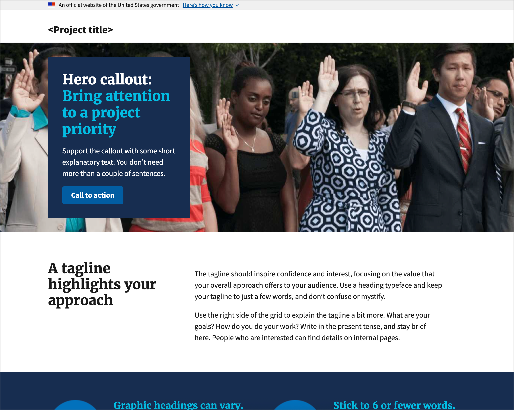
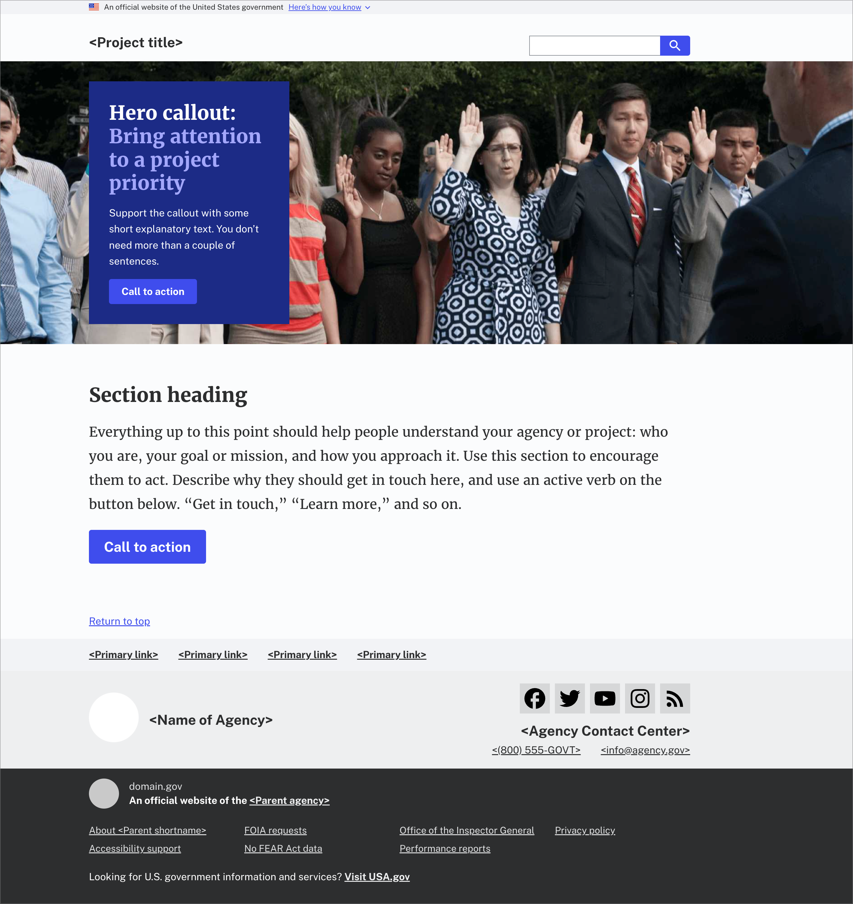
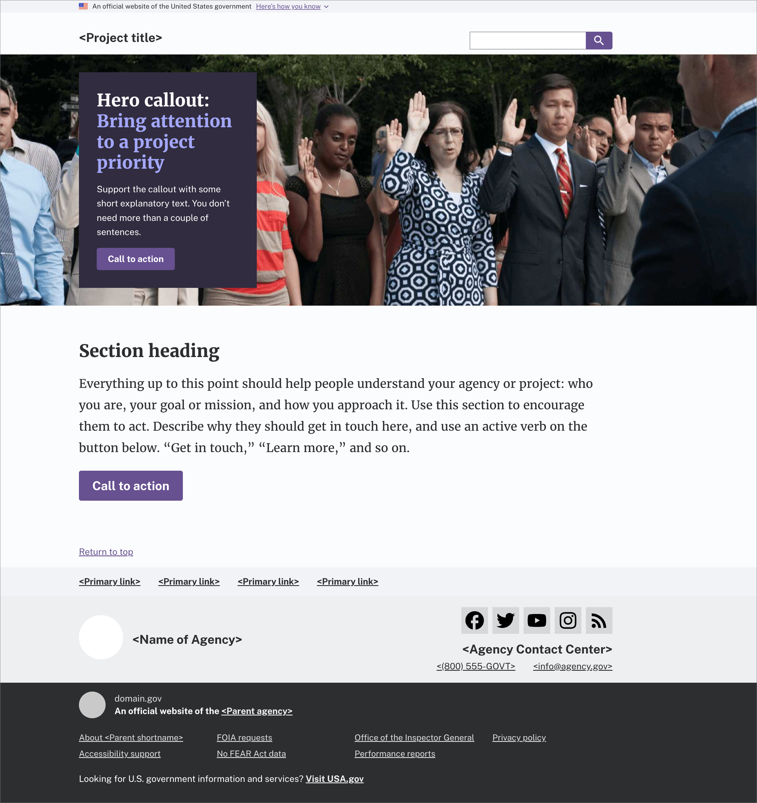

import { FileTree, Steps } from "@astrojs/starlight/components";

A design language is how you combine your basic elements (fonts, colors, spacing, etc.) to create a unified design experience with some light branding. It's a good first step to add a little personality to your products.

It allows developers to have good looking products from the start and designers the flexibility of extending and getting really creative. Most importantly, whatever direction you go in your product will be **consistent**, which is essential for earning trust.

**Why a design language is important**

- **A unique identity.** Apply your brand identity as a base theme so others can have a good default, but the flexibility of getting creative.
- **A consistent experience.** Your base theme will be immediately useful to developers who might not have designers immediately available. For example, a dashboard or a documentation site for a product.
- **Easier collaboration.** Teams can speak the same language by using semantically named tokens, like primary color or primary pink instead of `#ff69b4`.
- **Scalability.** New features naturally adopt the language, so you don't need to spend too much time or effort in tailoring it to your brand identity.
- **Quality checks.** Starting from a solid foundation based on accessibility and usability ensures that components are consistent and cohesive over time.

## USWDS as a Foundation

If you've used USWDS, you know it comes with a default theme that you can customize with SASS variables. But if you manage multiple sites, you should consider creating your own base design language. This way, you don't have to maintain separate "base" themes or keep copying the same overrides for each project.

Keep your base theme simple and neutral, with just enough branding to set a foundation. This way other products can easily extend, try out new themes, and add their own unique branding when needed.

### The Default Theme

USWDS comes with a default theme that you've probably seen many times.



By default, the primary color is `blue-60v` (`#005ea2`), the main body font is Source Sans Pro, and the headings are Merriweather Web.

If the product owner asks you to extend this and customize apply your agencies branding—that's easy, we just update the correct theme settings.

### Overriding the Defaults

You can easily update the theme settings using SCSS, which is the recommended way to override them. Your project might look like this:

<FileTree>

- package.json
- src
  - assets
    - styles
      - \_uswds-theme.scss # Your custom USWDS theme settings
      - \_your-custom-project-styles.scss # Your project's custom styles
      - index.scss # Your main styles entrypoint
  - components
    - …

</FileTree>

Below is an example of what your original custom USWDS theme override might look like, following the USWDS docs.

This SCSS partial has some global settings and theme color overrides:

```scss
// _uswds-theme.scss

@use "uswds-core" with (
  $theme-show-compile-warnings: false,
  $theme-show-notifications: false,
  //
  // Typography
  //
  $theme-font-type-sans: "public-sans",
  //
  // Colors
  //
  // Base gray
  $theme-color-base-family: "gray",
  $theme-color-base-lightest: "gray-10",
  $theme-color-base-lighter: "gray-20",
  $theme-color-base-light: "gray-30",
  $theme-color-base: "gray-60",
  $theme-color-base-dark: "gray-70",
  $theme-color-base-darker: "gray-80",
  $theme-color-base-darkest: "gray-90",
  $theme-color-base-ink: "gray-80",

  // Primary
  $theme-color-primary-family: "indigo-cool-vivid",
  $theme-color-primary-lightest: "indigo-cool-5",
  $theme-color-primary-lighter: "indigo-cool-10",
  $theme-color-primary-light: "indigo-cool-30",
  $theme-color-primary: "indigo-cool-60v",
  $theme-color-primary-vivid: "indigo-60v",
  $theme-color-primary-dark: "indigo-cool-70v",
  $theme-color-primary-darker: "indigo-cool-80v",
  $theme-color-primary-darkest: "indigo-cool-90v"
);
```

<small>
  Colors are from [System color tokens |
  USWDS](https://designsystem.digital.gov/design-tokens/color/system-tokens/#indigo).
</small>

Then you'd import it into your main SASS entrypoint.

```diff
// index.scss

+@forward "uswds-theme;
@forward "uswds";
@forward "your-custom-project-styles";
```

And your landing page should now use the Public Sans typeface and have a light gray and indigo based color scheme.



This is fine for a single one-off theme. Now fast forward a few months and now you're asked to extend that original custom theme for three smaller related products. If you wanted to re-use it you'd have to:

1. Create a new file
1. Copy over settings
1. Override what you previously overwrote
1. Keep any settings in sync from one to the other

If you wanted to create more themes maintaining them would get tedious real quick.

Luckily, SASS's new module system allows you to easily override and use that as a base, which you can then override again.

<Steps>

1.  #### Create a Base Theme

    In `_uswds-theme.scss` update your `@use` to `@forward`. For clarity, name your base theme after your main product. For example, Digital Gov would be `_dg-base-uswds-theme.scss`.

    ```diff
    // _uswds-theme-base.scss

    - @use "uswds-core" with (
    + @forward "uswds-core" with (
      // …
    );
    ```

    ```diff
    // index.scss

    -@forward "uswds-theme;
    +@forward "uswds-theme-extended;
    @forward "uswds";
    @forward "your-custom-project-styles";
    ```

    The `@forward` lets you define settings you want to reuse later. The `@use` imports settings into the current file so you can use them right away.

2.  #### Make an Extended Theme

    Then create a new SASS partial called `_uswds-theme-extended.scss`. Again, consider renaming it to match your child product name. Following the DigitalGov example, this could be PlainLanguage.gov: `_dg-pl-uswds-theme.scss`.

    {/* prettier-ignore-start */}

        <FileTree>
          - package.json
          - src
            - assets
            - styles
              - \_uswds-theme.scss
              - **\_uswds-theme-extended.scss** # New extended theme from base.
              - index.scss
            - components
            - …

        </FileTree>

    {/* prettier-ignore-end */}

3.  #### Reusing and Extending Base Theme

    Open the new file and use your new base theme settings file.

    ```scss
    // _uswds-theme-extended.scss
    @use "uswds-theme-base";
    ```

    This approach lets you apply the same base theme overrides. It's useful if you're working on a child product that has the same branding, like an intranet, a brochure site, or a documentation site. You get the same consistency without the extra work.

4.  #### Customizing the Child Theme

    Now, when you want to extend and create a new theme based on your previous overrides, just update the settings that are different. This lets you reuse your base theme and only change what's different for each new product.

    For example, if you're working on a new Plain language site based on our DigitalGov theme, you only need to update the colors or branding that are specific to Plain language.

    ```scss
    // _uswds-theme-extended.scss
    @use "uswds-theme-base" with (
      $theme-color-primary-family: "violet",
      $theme-color-primary-lightest: "violet-5",
      $theme-color-primary-lighter: "violet-10",
      $theme-color-primary-light: "violet-30",
      $theme-color-primary: "violet-60",
      $theme-color-primary-vivid: "violet-60v",
      $theme-color-primary-dark: "violet-70",
      $theme-color-primary-darker: "violet-80",
      $theme-color-primary-darkest: "violet-90"
    );
    ```

    This method creates a new theme by layering your previous overrides with any new changes. It makes it fast and easy to manage multiple themes that look similar but have their own custom details.

    

</Steps>
